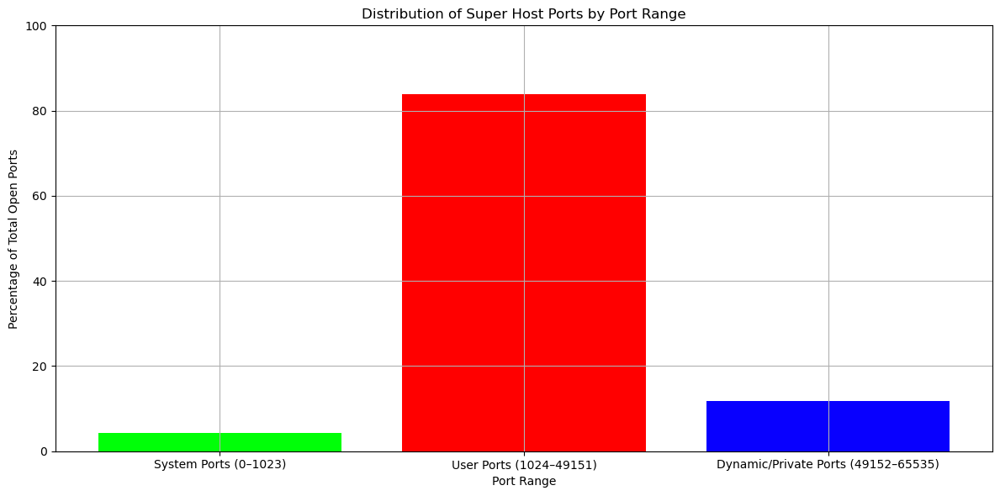
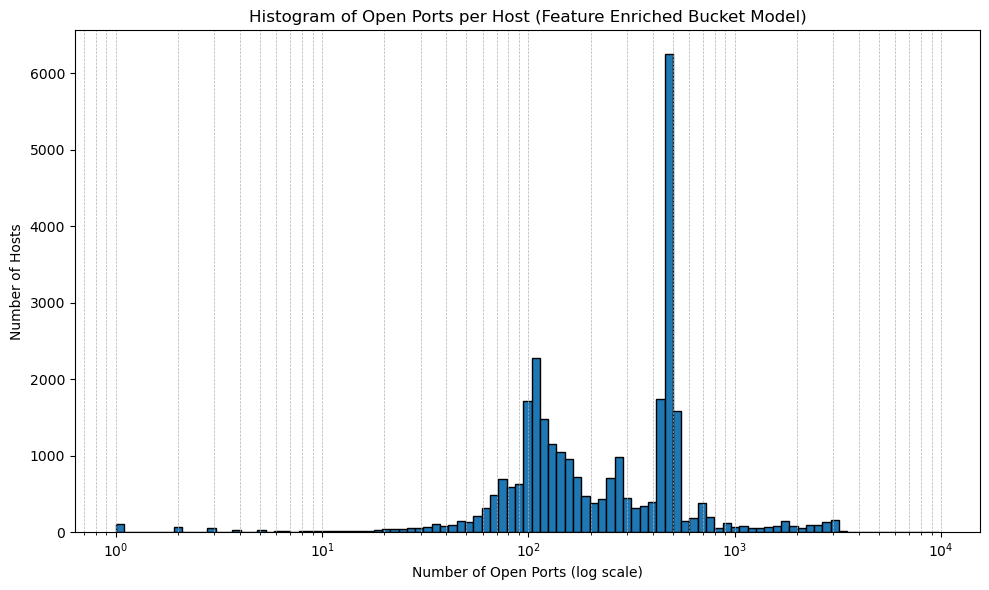
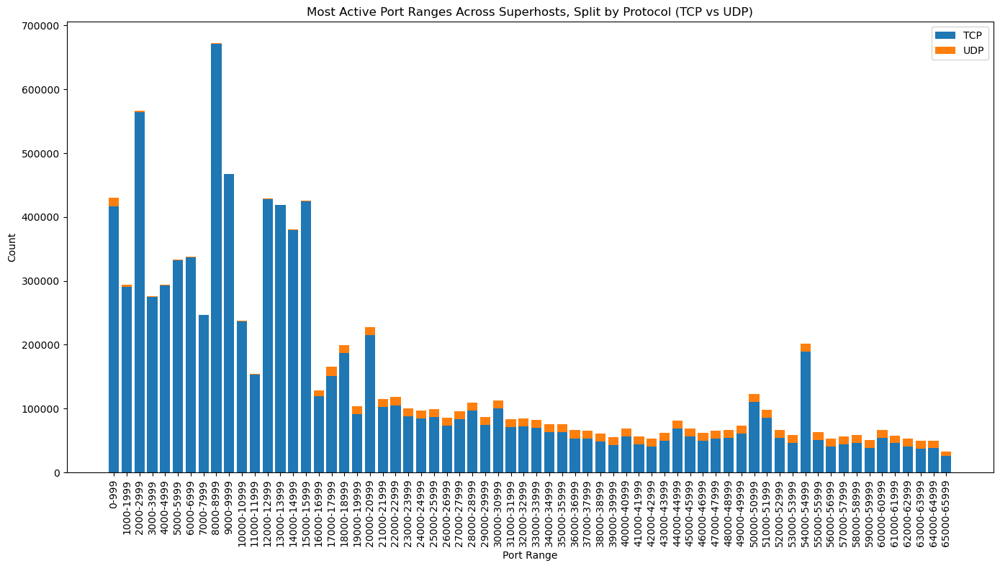
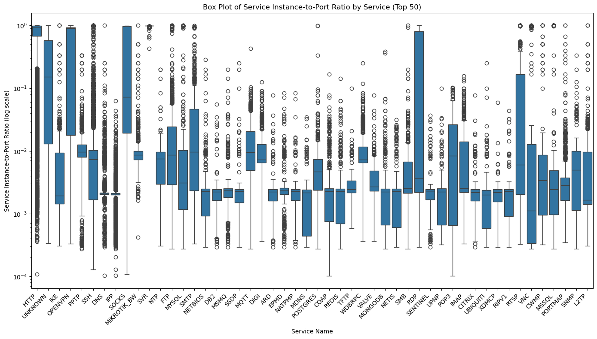
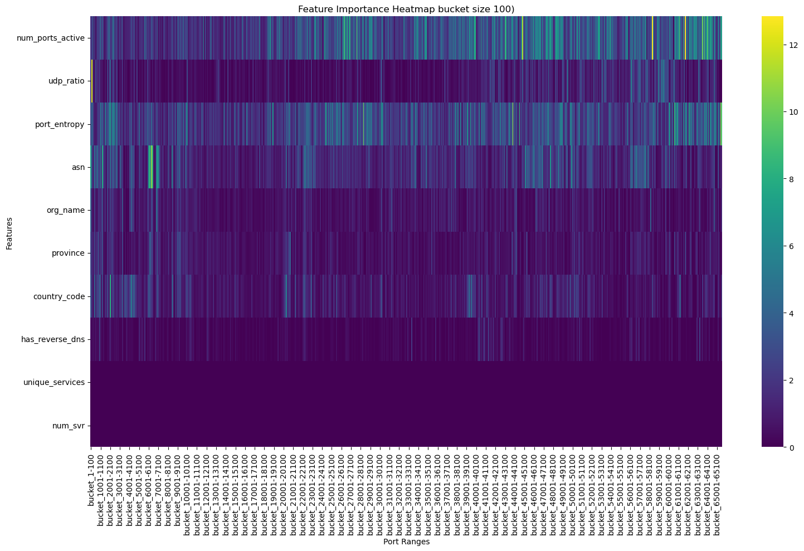
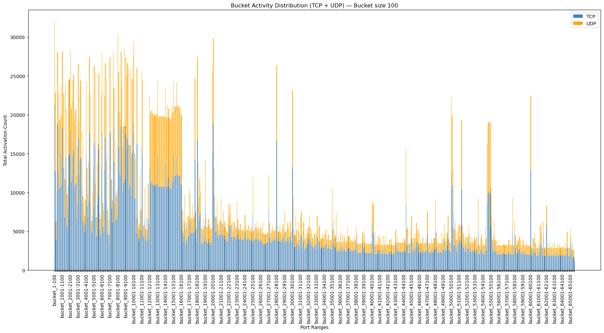
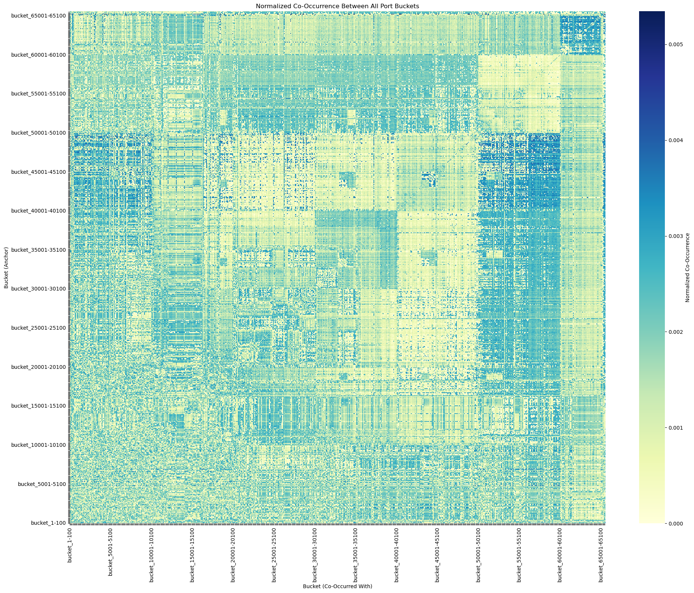

# Feature Enriched Bucket Model Guide:

The following readme, describes the steps needed to run the code used to create a subset of the overall dataset, train the model, and export figures contained within the paper. Because of the sheer size of the dataset, you will need to locally store a copy of the set found here: 

```
https://ucla.app.box.com/s/yg4rdlz5arpn3jkz6dgdhekj2f3wmrjp
```

The dataset will need to be stored in a subfolder of your working directory called "dataset" before your are able to preprocess the data for model training and evaluation.

This folder will be hosted till 6/15/25

## How to use the scripts:
First install the required python packages to your local environment using the following command in terminal:
```
pip install -r requirements_bucket.txt
```

### Dataset Preprocessing:
Once the python packages have been installed, you can run the `preprocessing.ipynb` file to create a subset of the overall dataset for analysis. The following describes the influece of each variable below:

* `data_dir:` Where the notebook will source your dataset from
* `percentage_to_load:` The percentage of the dataset that will be loaded
* `seed:` The value use to control the random subset of the data
* `output_path:` The name of the output data subset

```python
# Configuration
data_dir = "./dataset"
percentage_to_load = 5
seed = 42

# Intermediate Setup and Preprocessing 
...

# Preview final output 
output_path = "superhost_5percent.parquet"

```

### Model Training:
Once a subset of the data has been created using the preprocessing notebook, we now need to modify the following cell line to match the `output_path` variable set in the previously used notebook.

```python
df = pd.read_parquet("./superhost_5percent.parquet")
```
After cell two of the `training.ipynb` file has run, inspect your dataset to ensure that the parquet file was properly loaded, the dimentions should be `N (row) x 65547 (column)` where N is the number of Super-host's scanned within the datasub set.

After the dataset has been loaded, the following code cell block will create the addtionally engineered features based of the available metadata. To tune the bucket size of the model, meaning to change size of the uniform divisions of the port space, only a single line of code needs to be modified in the 3rd cell of the `training.ipynb` notebook.

```python
# Declare Bucket Size
bucket_size = 100
```
After this cell block, all remaining cells can be run without additional code modificiations to generate the following graphics in the following order:









To recreate the tabel 3 of the paper, comment out this code section and run the entire notebook, other than cell 9, for bucket size 100, 75, 50 and 25:

```python
# Bucket co-occurrences
bucket_matrix = y.values
num_buckets = bucket_matrix.shape[1]
co_matrix = (bucket_matrix.T @ bucket_matrix).astype(np.int32)
co_bucket_map = {}
for i in range(num_buckets):
    co_matrix[i, i] = -1
    top5 = np.argsort(co_matrix[i])[::-1][:5]
    co_bucket_map[i] = top5

co_bucket_features = np.zeros((len(bucket_matrix), num_buckets), dtype=np.uint8)

for i in range(num_buckets):
    related = co_bucket_map[i]
    co_bucket_features[:, i] = (
        (bucket_matrix[:, i] == 1) * bucket_matrix[:, related].sum(axis=1)
    ).astype(np.uint8)

co_bucket_features = co_bucket_features / 5.0

bucket_col_names = y.columns.tolist()
co_bucket_col_names = [f"{name}_coactive_top5" for name in bucket_col_names]
co_bucket_df = pd.DataFrame(co_bucket_features, columns=co_bucket_col_names, index=df.index)

X = pd.concat([X, co_bucket_df], axis=1)
```

To recrate the results from table 4, run the unmodified notebook in its entirety for bucket size 100, 75, 50 and 25